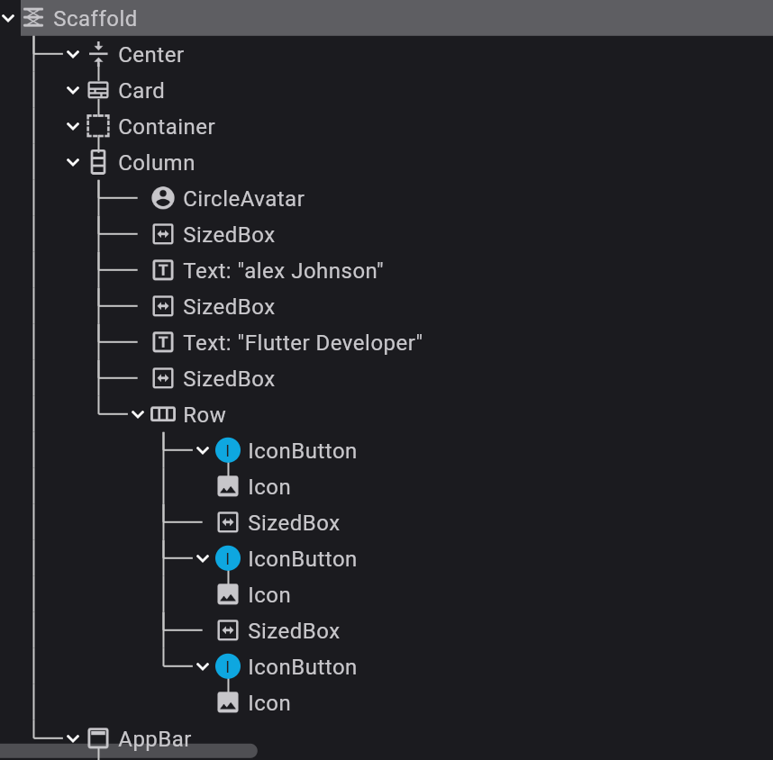
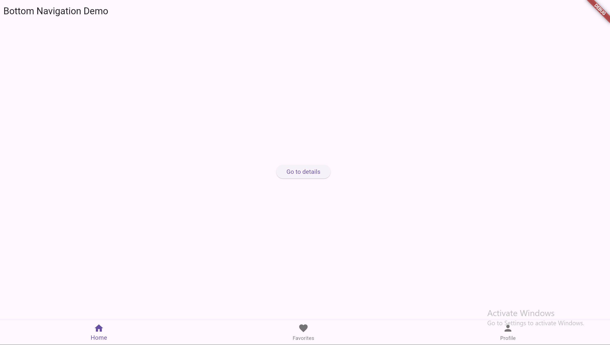
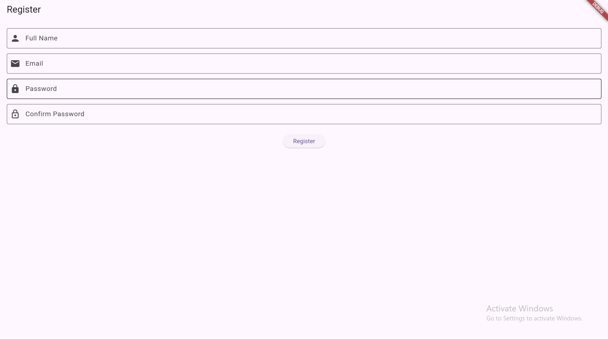
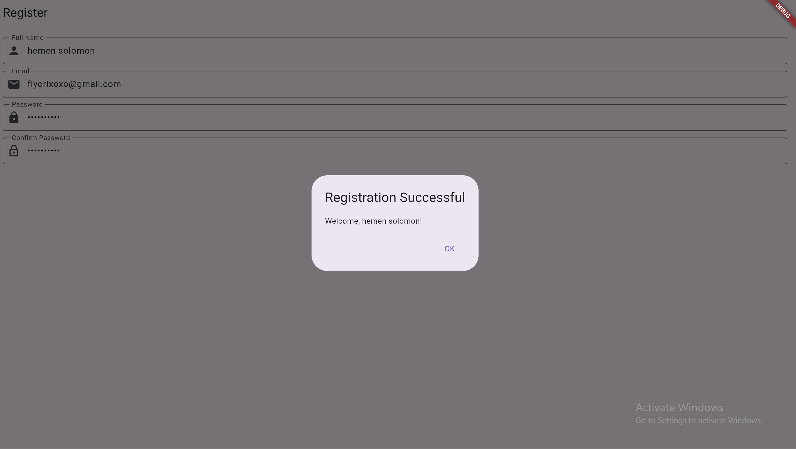

# Flutter Widgets Lab Assignments

## Lab 1: Profile Card
- Built using Flutter
- Demonstrates layout widgets

### Screenshots

### Widget Tree

## Lab 2: Bottom Nav Lab
### Screenshots

### Widget Tree

## Lab 3: Catalog Lab
### Screenshots

### Widget Tree

## Lab 4: registration Lab
### Screenshots

### Widget Tree

